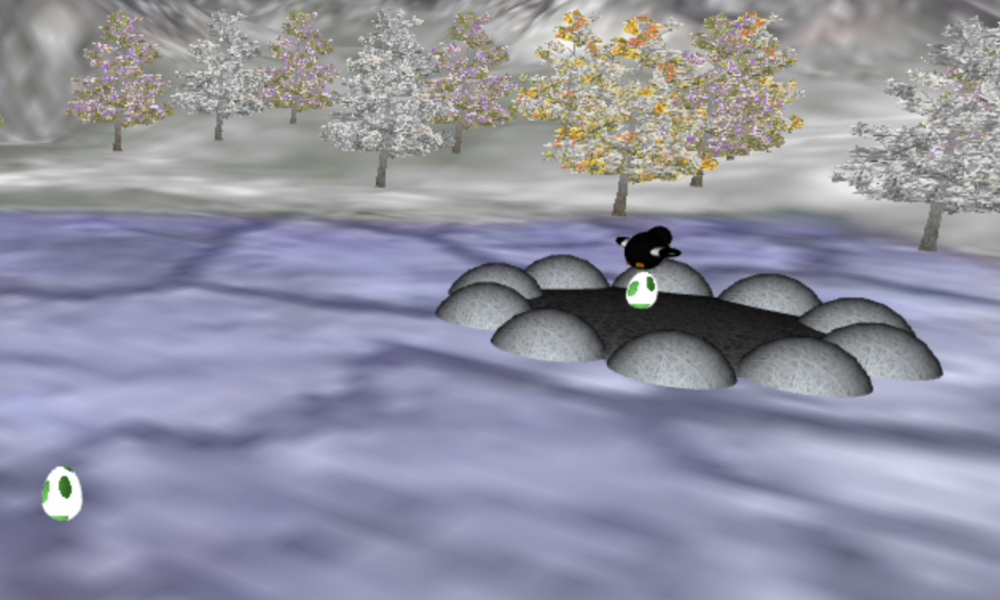

# CG 2022/2023

## Group T02G06

## Project Notes

### 2 - Creation of Panoramas

### 3 - Inclusion of a Bird (Penguin)

Two videos to demonstrate the penguin's animation and movement control (click on the images to see them):

- Animation:

- Movement Control:

### 4 - Terrain

### 5 - Eggs and Nest

Click on the following image to see the demo video:

### 6 - Billboards

- MyTreeGroupPatch:

- MyTreeRowPatch:

### 7 - Extra

Parabola trajectory of the egg when it is dropped by the bird to be deposited in the nest

- Before:

- After modififaction:

### Final Video

