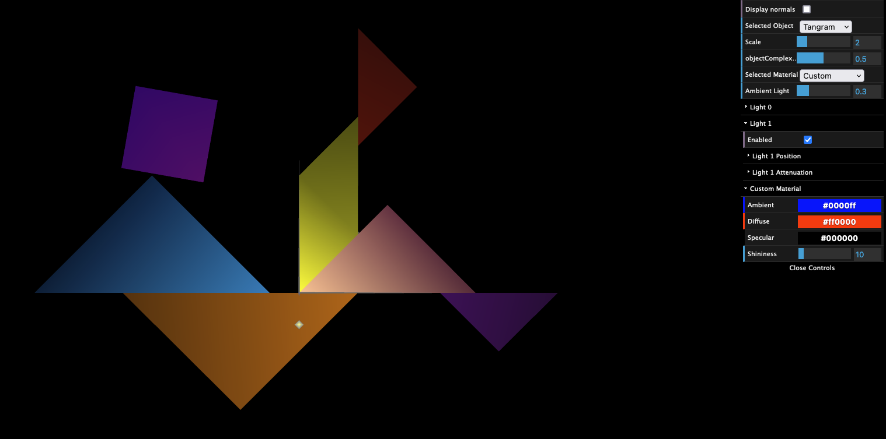

# CG 2022/2023

## Group T02G06

## TP 3 Notes

### Cube in Wood

### Tangram with Colors

- With original colors

.png)

- With Custom Diamond

### Column 

- with 1 Stack and 8 Slices

.png)

- with 20 Stacks and 8 Slices

### Cylinder 

- with 20 Stacks and 8 Slices

