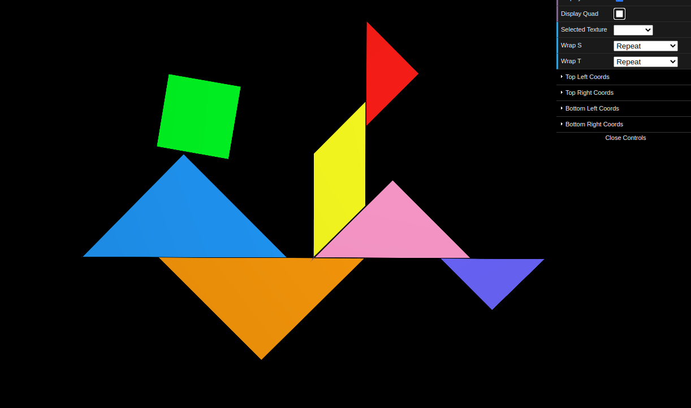
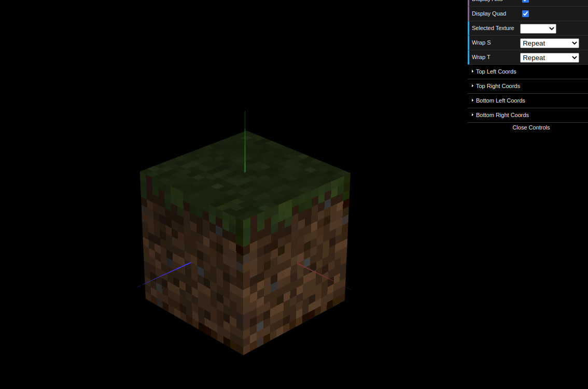

# CG 2022/2023

## Group T02G06

## TP 4 Notes

### Tangram with Textures

### Minecraft Cube

#### Note:
We couldn't commit separately for each exercise, however most of the work was done in separate files (tp4-1 - MyTangram.js and tp4-2 - MyUnitCube.js)